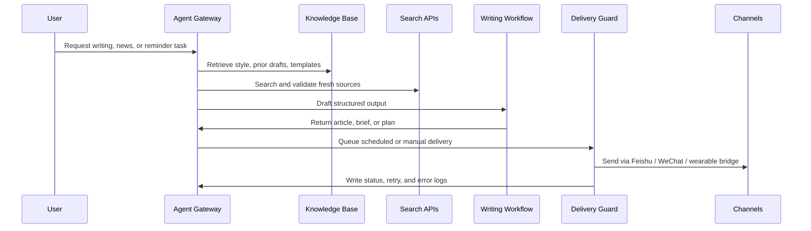

# Architecture

This project validated an AI office workflow in three layers:

1. **Agent reasoning layer**: Codex/OpenClaw-style model routing for planning, research, drafting, and tool decisions.
2. **Tool integration layer**: search APIs, Notion, YouTube, Firecrawl, GitHub, DOCX generation, and local file workflows.
3. **Delivery layer**: Feishu, WeChat, scheduled cron tasks, and a wearable-device bridge prototype.

## Runtime Flow

## Design Principles

- **Agent first, automation second**: let the model reason through the work before running fixed scripts.
- **Visible operations**: every scheduled job should leave logs that can be inspected.
- **Recoverable delivery**: push workflows need retry, dedupe, and fallback states.
- **Knowledge over prompts**: good writing quality depends on reusable examples, style rules, and source dossiers.
- **Separation of concerns**: Codex handles intelligence; MCP exposes tools; small services handle unattended scheduling.

