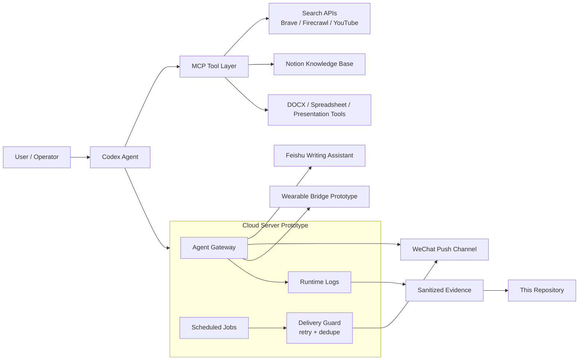

# Agentic Office Workflow Hub

> A production-style AI office automation prototype that connects research, writing, knowledge capture, scheduled delivery, and multi-channel agent operations.


## What This Project Proves

This repository documents a real server-side Agent workflow prototype that was used to validate:

- Multi-channel AI assistant routing through Feishu, WeChat, and a wearable-device bridge.
- Scheduled AI information delivery, including weather, noon AI news, and evening AI tools/skills briefings.
- Knowledge-base driven formal writing workflows for communications drafts, training reports, visit reports, and office materials.
- Operational guardrails: systemd services, cron jobs, delivery retries, health checks, log-based debugging, and controlled decommissioning.
- A later migration path from a brittle all-in-one Agent gateway to a cleaner Codex + MCP workflow.

The goal was not to build a toy chatbot. The goal was to test whether AI agents could become a practical personal office operating layer: researching, remembering, drafting, delivering, and monitoring work with minimal manual glue.

## Live Evidence

The screenshot below is generated from sanitized server terminal logs. It shows the Agent gateway startup, model routing, plugin registration, WeChat/Feishu/Rokid channel startup, scheduled cron workflows, delivery logs, and cleanup verification.


## Architecture



## Core Outcomes

| Area | Outcome |
| --- | --- |
| Agent runtime | Deployed and operated a server-side Agent gateway with model routing and plugin loading. |
| Multi-channel integration | Validated Feishu writing, WeChat push, and wearable-device bridge workflows. |
| Scheduled automation | Implemented morning weather, noon AI news, and evening AI tools/skills briefing schedules. |
| Delivery reliability | Added delivery guard behavior, status logs, retry paths, and fallback diagnostics. |
| Knowledge-driven writing | Organized source materials, best drafts, document patterns, constraints, and house style for formal Chinese writing. |
| Security posture | Produced a sanitized public version and intentionally excluded raw tokens, secrets, private chat screenshots, and credentials. |

## Repository Map

```text
.
├── assets/
│   ├── server-agent-logs-sanitized-20260430.png
│   └── server-agent-logs-sanitized-20260430.txt
├── docs/
│   ├── architecture.md
│   ├── impact.md
│   ├── operations.md
│   ├── security.md
│   └── writing-knowledge-workflow.md
├── examples/
│   ├── config/agent-config.example.json
│   ├── cron/agent-crontab.example
│   └── systemd/agent-gateway.service.example
└── scripts/
    ├── sanitize_logs.py
    └── verify_no_secrets.py
```

## Why This Matters

Office work is usually fragmented: search in one place, draft in another, store materials somewhere else, then manually send reminders and summaries. This prototype explored the opposite direction: an Agent-centered workbench that can gather information, preserve context, generate formal outputs, and deliver them through real channels.

The most valuable lesson was architectural. A capable AI assistant should not hide everything inside one fragile bot. The more robust design is:

- Use Codex as the primary reasoning and production agent.
- Use MCP as the tool boundary for search, Notion, GitHub, YouTube, Firecrawl, and document work.
- Use small, inspectable services only when automation needs to run unattended.
- Keep secrets local or server-side, never inside public repositories.

## Security Note

This is a public, sanitized portfolio repository. Raw server archives, private knowledge bases, API tokens, conversation logs, and personal/company source materials are intentionally excluded.

See [docs/security.md](docs/security.md) for the sanitization policy.

